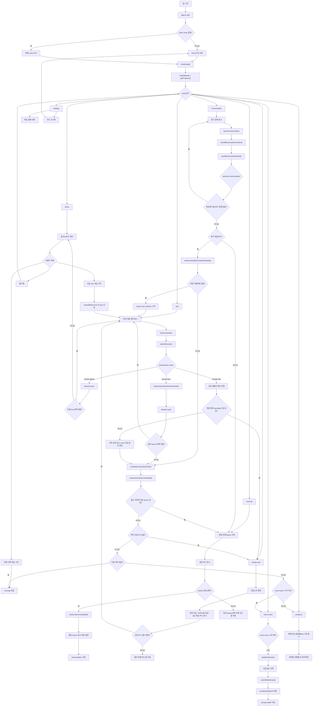
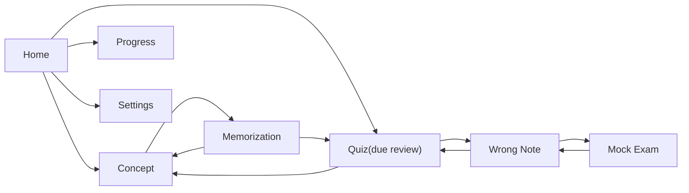

# App Flow Chart

이 문서는 `src/app.js`, `src/ui.js`, `src/router.js`, `src/storage.js` 기준으로 정리한 전체 앱 흐름도다.

## 추천 작성 방식

가장 추천하는 방식은 `Mermaid`를 원본으로 관리하는 것이다.

- 장점: 텍스트 기반이라 Git 추적이 쉽다.
- 장점: 화면 흐름이 바뀌면 코드처럼 수정 가능하다.
- 장점: Notion, GitHub, Markdown 문서로 재사용하기 쉽다.

## Notion 사용법

Notion도 괜찮다. 다만 작성 원본은 Notion 전용 도형 편집보다 `Mermaid` 코드가 더 유지보수에 유리하다.

권장 방식:

1. Notion 페이지에서 `/code` 블록을 만든다.
2. 언어를 `Mermaid`로 바꾼다.
3. 아래 Mermaid 코드를 붙여 넣는다.
4. 코드 블록의 보기 모드를 `Preview` 또는 `Split`으로 전환한다.

추천 워크플로우:

- 원본 관리: 이 파일의 Mermaid 코드
- 공유/정리: Notion 페이지
- 수정 기준: 코드 변경 후 Mermaid도 같이 갱신

## 전체 앱 흐름

## 화면 중심 요약

## 핵심 규칙

- 새 lesson은 `개념 완료 -> 암기 100% 통과 -> lesson 기출 완료` 순서로 진행된다.
- 암기 세션은 전부 맞혀야 통과한다. 하나라도 틀리면 같은 lesson 개념 화면으로 돌아간다.
- due 복습은 `reviewMode`와 `reviewScheduler` 기준으로 퀴즈 화면에서 순차 진행된다.
- 과목 lesson이 끝나도 과목 오답이 남아 있으면 다음 과목으로 바로 넘어가지 않고 `wrong-note`를 먼저 처리한다.
- 모든 과목과 과목 오답 정리가 끝나면 `mock-exam` 진입 조건이 열린다.

