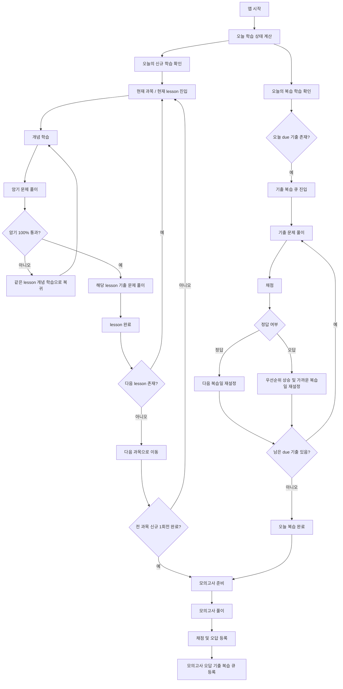
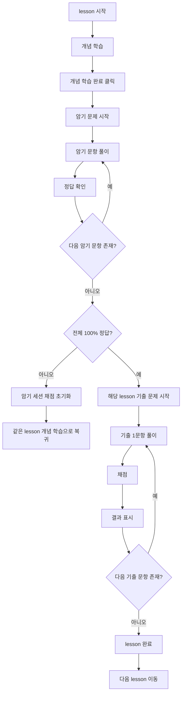
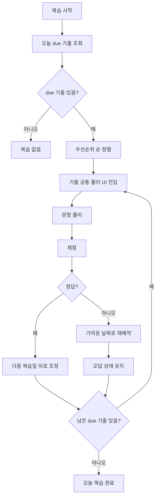

# 학습 흐름 초안

이 앱은 `신규 학습`과 `복습 학습`을 분리해서 운영한다.

## 핵심 원칙

- 신규 학습은 `개념 -> 암기 100% 통과 -> 해당 lesson 기출 -> 다음 lesson` 순서로 진행한다.
- 복습 학습은 `오늘 due 된 기출 문제`만 복습 큐에서 꺼내서 처리한다.
- 암기 문항은 신규 학습 단계의 통과 게이트로만 사용하고, 복습 큐에는 넣지 않는다.
- 기출문제 풀이 UI는 신규 기출, 오답노트, due 복습, 모의고사 오답 복습에 동일하게 사용한다.
- 하루 학습량은 `신규 학습량 + 기출 복습 학습량`으로 본다.

## 전체 흐름

## 신규 학습 상세

## 복습 학습 상세

## 복습 큐 규칙

- 기출 정답: `1일 -> 7일`
- 기출 오답: `당일 -> 1일 -> 3일 -> 7일`
- 같은 문항이 이미 큐에 있으면 새 항목을 계속 만들지 않고 기존 due와 상태를 갱신한다.

## 화면별 역할

- 홈: 오늘의 신규 학습, 오늘의 복습 학습, due 수량, 권장 신규 물량 표시
- 개념학습: lesson 개념 확인 후 암기로 이동
- 암기학습: 신규 암기만 처리
- 기출문제: 신규 기출, due 복습, 오답노트, 모의고사 오답 복습에 공통 UI 사용
- 오답노트: 누적 오답 기록과 due 기출 복습 확인
- 학습현황: 신규 진도, 오늘 기출 복습량, 과목별 취약도 확인
- 설정: 30일/60일 플랜 선택, 학습 기록 초기화
